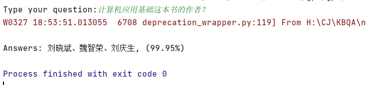

# 开放域知识库问答系统
## 数据集介绍
- NLPCC开放域知识图谱问答比赛数据集
  - 介绍：
    - 问题类型：简单问题（单跳问题）
    - 训练集：14609
    - 验证集 + 测试集：9870

## 项目架构

基于NIPCC知识库问答数据集，利用BERT+BiLSTM+CRF进行命名实体识别，抽取问题中的实体。从知识库中提取实体相关的所有属性，利用BERT训练句子相似度计模型，计算问题与各属性之间的文本相似度，基于相似度对属性排序，最终得到问题答案。

目前只用了知识库实现（MySQL），后续会钻研一下知识图谱。

常规方法可以参考：
1. [豆瓣影评问答](https://github.com/weizhixiaoyi/DouBan-KGQA) 
2. [基于医疗知识图谱的问答系统](https://github.com/zhihao-chen/QASystemOnMedicalGraph)
3. [NLPCC2016 KBQA 1st 方案](https://github.com/huangxiangzhou/NLPCC2016KBQA)

## 运行说明

下载文件：

- Google官方BERT：https://github.com/google-research/bert ，更名为```bert```，放在根目录下
- BERT中文配置文件：[chinese_L-12_H-768_A-12](https://storage.googleapis.com/bert_models/2018_11_03/chinese_L-12_H-768_A-12.zip)，放在```bert```目录下
- NIPCC数据集：[data/NLPCC2016KBQA](data/NLPCC2016KBQA)（可自行官方下载）

数据集构建（请先更改```data_config.py```的MySQL配置）：

```
mkdir data/NER
mkdir data/SIM
cd data_helper
python ner_data.py
python sim_data.py
python kb_data.py
cd ..
```

训练命名实体识别模型（NER）：

```
cd ner
mkdir output
sh ./run_ner.sh
$ cd ..
```

将```ner/ner_config.py```中的```model_file=model/xxxxxxx```更改为```ner/output/model```下的文件夹名称。

参数配置与结果
```
batchsize = 16
learning_rate = 10-5
global_step = 1625(2 epochs)
eval_precision = 0.99915755
eval_recall = 0.99987036
eval_f = 0.976385
loss = 0.5831084
```


训练文本相似度模型（SIM）：

```
cd sim
mkdir output
sh ./run_sim.sh
cd ..
```

将```sim/sim_config.py```中的```model_file=model/xxxxxxx```更改为```sim/output/model```下的文件夹名称。

参数配置与结果
```
batchsize = 32
learning_rate = 10-5
global_step = 12190(5 epochs)
eval_accuracy = 0.9860696
loss = 0.08594935
eval_loss = 0.086046584
```
进行线上的问答测试：

```
python kbqa.py
```

效果如下：



## 环境

- python 3.6.5
- tensorflow 1.14
- RTX 2080 Ti
